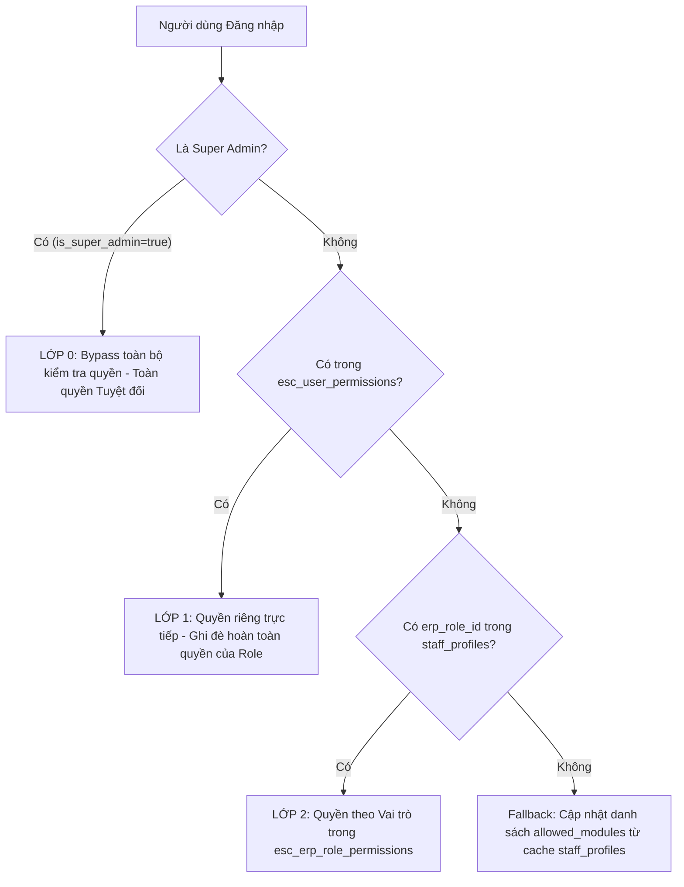

# TỔNG QUAN DỰ ÁN KHO ESC WMS

Dự án **ESC WMS (Warehouse Management System)** là một hệ thống quản lý kho hàng cao cấp, hiện đại và bảo mật được thiết kế tối ưu cho mô hình multi-site (đa chi nhánh/website) của ESC. Hệ thống được xây dựng và tối ưu hóa liên tục thông qua sự phối hợp chặt chẽ giữa hai nhà phát triển:
*   **KA (Knowledge Agent / Backend & DB Developer)**: Thiết kế database schema, chính sách bảo mật RLS, phân quyền 3 lớp và các dịch vụ nền tảng.
*   **MI / MIKE (Frontend & UI/UX Developer)**: Hiện thực hóa giao diện người dùng bằng tiếng Việt, tối ưu hóa responsive, xây dựng các bộ parser Excel (.xlsx) thông minh trực tiếp tại Client-Side.

---

## 1. Cấu hình Hệ thống & Quy tắc Tối cao (TOP_RULES)

Hệ thống tuân thủ nghiêm ngặt các quy định cốt lõi tại [TOP_RULES.md](file:///d:/MICHAEL/__MY%20DREAM/A%20I/1SSG/ESC-kho/TOP_RULES.md):
*   **Môi trường phát triển**: Luôn chạy local tại cổng `http://localhost:3001` (đã cấu hình trong [vite.config.ts](file:///d:/MICHAEL/__MY%20DREAM/A%20I/1SSG/ESC-kho/vite.config.ts)).
*   **Kết nối Database**: Supabase trực tiếp qua dự án `jhebreoxwuimlqwvjdok.supabase.co`. Mọi truy vấn database trong mã nguồn phải đi qua hàm helper `TABLE(name)` của tệp [supabaseClient.ts](file:///d:/MICHAEL/__MY%20DREAM/A%20I/1SSG/ESC-kho/supabaseClient.ts) để tự động thêm tiền tố `esc_` (ví dụ: `TABLE('users')` tương đương bảng `esc_users`).
*   **Giao diện**: Hoàn toàn bằng **Tiếng Việt**, thiết kế hiện đại, premium, sử dụng logo chính thức `/ESC__logo-01.jpg`.
*   **Định dạng chuẩn**:
    *   **Ngày tháng**: Hiển thị dạng `dd/mm/yyyy` trên UI; hỗ trợ thông minh định dạng ngày `dd-mm-yyyy` trong các tệp Excel mẫu nhập liệu.
    *   **Giờ giấc**: Múi giờ Việt Nam (GMT+7) định dạng `hh:mm:ss`.
*   **Multi-site Support**: Mỗi bảng dữ liệu đều chứa trường `website_id INTEGER[]` (mảng) nhằm chia sẻ và phân tách dữ liệu linh hoạt giữa các website/chi nhánh.

---

## 2. Kiến trúc Phân quyền 3 Lớp Chặt chẽ

Hệ thống áp dụng cơ chế phân quyền 3 lớp tinh xảo được tài liệu hóa chi tiết tại [ROLE-CONFIG-skill.md](file:///d:/MICHAEL/__MY%20DREAM/A%20I/1SSG/ESC-kho/ROLE-CONFIG-skill.md):

### Chi tiết các lớp quyền:
1.  **Lớp 0 (Super Admin)**: Bypass tất cả các bước kiểm tra, tự động mở toàn bộ các module và quyền CRUD.
2.  **Lớp 1 (Quyền riêng - User Permissions)**: Quyền gán trực tiếp cho từng nhân viên tại bảng `esc_user_permissions`. Nếu lớp này tồn tại, phân quyền theo Role sẽ bị vô hiệu hóa hoàn toàn đối với nhân viên đó.
3.  **Lớp 2 (Quyền theo Vai trò - Role Permissions)**: Được xác định bởi 5 vai trò mặc định trong hệ thống:
    *   **`customer` (Khách hàng)**: Chỉ có quyền đọc (Read) phân hệ xử lý đơn.
    *   **`staff` (Nhân viên)**: Quyền CRUD (trừ Delete) cho các phân hệ Đơn nhập, Đơn xuất, Xử lý đơn và Vận hành.
    *   **`leader` (Trưởng nhóm)**: Quyền nhân viên + quyền đọc phân hệ Kho hàng, Báo cáo và Nhân sự.
    *   **`admin` (Quản trị)**: Quyền CRUD toàn bộ hệ thống ngoại trừ chức năng xoá của Nhân sự & Tài chính.
    *   **`super_admin` (Toàn quyền)**: Quyền năng tối cao trên toàn hệ thống.

---

## 3. Bản đồ Module & Cấu trúc Tệp tin

Hệ thống quản lý kho được phân chia thành **10 phân hệ chính** tương ứng với các tệp tin chức năng nằm trong thư mục [pages](file:///d:/MICHAEL/__MY%20DREAM/A%20I/1SSG/ESC-kho/pages/):

| STT | Tên Phân Hệ | Module ID | Tệp tin Frontend (.tsx) | Chức năng chính |
| :--- | :--- | :--- | :--- | :--- |
| **1** | **Đơn nhập** | `inbound` | [InboundManager.tsx](file:///d:/MICHAEL/__MY%20DREAM/A%20I/1SSG/ESC-kho/pages/InboundManager.tsx) [InboundNew.tsx](file:///d:/MICHAEL/__MY%20DREAM/A%20I/1SSG/ESC-kho/pages/InboundNew.tsx) [InboundList.tsx](file:///d:/MICHAEL/__MY%20DREAM/A%20I/1SSG/ESC-kho/pages/InboundList.tsx) [InboundReceive.tsx](file:///d:/MICHAEL/__MY%20DREAM/A%20I/1SSG/ESC-kho/pages/InboundReceive.tsx) [InboundReturn.tsx](file:///d:/MICHAEL/__MY%20DREAM/A%20I/1SSG/ESC-kho/pages/InboundReturn.tsx) [InternalProcess.tsx](file:///d:/MICHAEL/__MY%20DREAM/A%20I/1SSG/ESC-kho/pages/InternalProcess.tsx) | Quản lý điều hợp toàn bộ đơn nhập hàng dưới dạng Pill Tabs cực đẹp. Hỗ trợ import Excel đa dạng (Multi-PO Import), tự động bóc tách và tạo đơn hàng loạt theo từng nhà cung cấp và mã Serial, đối soát validation trực quan trước khi lưu. |
| **2** | **Đơn xuất** | `outbound` | [OutboundManager.tsx](file:///d:/MICHAEL/__MY%20DREAM/A%20I/1SSG/ESC-kho/pages/OutboundManager.tsx) [OrderList.tsx](file:///d:/MICHAEL/__MY%20DREAM/A%20I/1SSG/ESC-kho/pages/OrderList.tsx) [OrderDetail.tsx](file:///d:/MICHAEL/__MY%20DREAM/A%20I/1SSG/ESC-kho/pages/OrderDetail.tsx) | Quản lý quy trình xuất đơn hàng (Sales Order - SO) qua 4 bước tuần tự: **Mới** (`new`) → **Đang soạn** (`picking`) → **Đang đóng gói** (`packing`) → **Đang xếp tuyến** (`routing`) → **Đã bàn giao** (`shipped`). Tự động làm sạch giao dịch cũ khi import đè dữ liệu Excel SO. |
| **3** | **Soạn & Đóng gói** | `outbound` | [Picking.tsx](file:///d:/MICHAEL/__MY%20DREAM/A%20I/1SSG/ESC-kho/pages/Picking.tsx) [Packing.tsx](file:///d:/MICHAEL/__MY%20DREAM/A%20I/1SSG/ESC-kho/pages/Packing.tsx) [Routing.tsx](file:///d:/MICHAEL/__MY%20DREAM/A%20I/1SSG/ESC-kho/pages/Routing.tsx) [BarcodeScanner.tsx](file:///d:/MICHAEL/__MY%20DREAM/A%20I/1SSG/ESC-kho/pages/BarcodeScanner.tsx) | Hỗ trợ thủ kho soạn hàng, đóng gói hộp carton và gán mã vận chuyển thông minh. Tích hợp máy quét Barcode/QR tìm kiếm mã Serial sản phẩm từ DB tức thì. |
| **4** | **Kho hàng** | `inventory` | [WarehouseMap.tsx](file:///d:/MICHAEL/__MY%20DREAM/A%20I/1SSG/ESC-kho/pages/WarehouseMap.tsx) [WarehouseLocation.tsx](file:///d:/MICHAEL/__MY%20DREAM/A%20I/1SSG/ESC-kho/pages/WarehouseLocation.tsx) [RackMap.tsx](file:///d:/MICHAEL/__MY%20DREAM/A%20I/1SSG/ESC-kho/pages/RackMap.tsx) [PutAway.tsx](file:///d:/MICHAEL/__MY%20DREAM/A%20I/1SSG/ESC-kho/pages/PutAway.tsx) | Sơ đồ 3D mặt bằng kho, quản lý vị trí kệ hàng (Rack Location) và hỗ trợ chỉ định vị trí cất hàng tối ưu. |
| **5** | **Vận hành** | `operation` | [OpSplit.tsx](file:///d:/MICHAEL/__MY%20DREAM/A%20I/1SSG/ESC-kho/pages/OpSplit.tsx) [OpRepack.tsx](file:///d:/MICHAEL/__MY%20DREAM/A%20I/1SSG/ESC-kho/pages/OpRepack.tsx) [OpAudit.tsx](file:///d:/MICHAEL/__MY%20DREAM/A%20I/1SSG/ESC-kho/pages/OpAudit.tsx) [OpReplenish.tsx](file:///d:/MICHAEL/__MY%20DREAM/A%20I/1SSG/ESC-kho/pages/OpReplenish.tsx) [OpTransfer.tsx](file:///d:/MICHAEL/__MY%20DREAM/A%20I/1SSG/ESC-kho/pages/OpTransfer.tsx) | *   **Rã hàng lẻ**: Chuyển thùng hàng chẵn thành các đơn vị cái lẻ theo tỷ lệ cấu hình DB. *   **Đóng gói lại**: Hộp lại sản phẩm lỗi hoặc gộp lô hàng. *   **Kiểm kê**: Quản lý các phiên kiểm kê kho hàng tháng (layout 2 cột thông minh). *   **Luân chuyển**: Điều chuyển hàng hóa nội bộ giữa các vị trí kệ/kho hàng. *   **Châm hàng**: Tự động cảnh báo khi tồn kho chạm ngưỡng thiết lập để đưa hàng từ khu dự trữ sang khu soạn hàng. |
| **6** | **Báo cáo** | `reports` | [InventoryReport.tsx](file:///d:/MICHAEL/__MY%20DREAM/A%20I/1SSG/ESC-kho/pages/InventoryReport.tsx) [InboundReport.tsx](file:///d:/MICHAEL/__MY%20DREAM/A%20I/1SSG/ESC-kho/pages/InboundReport.tsx) [OutboundReport.tsx](file:///d:/MICHAEL/__MY%20DREAM/A%20I/1SSG/ESC-kho/pages/OutboundReport.tsx) [ProcessReport.tsx](file:///d:/MICHAEL/__MY%20DREAM/A%20I/1SSG/ESC-kho/pages/ProcessReport.tsx) | *   **BC Xuất Nhập Tồn (XNT)**: Phân tích chi tiết hàng hóa tồn kho thực tế theo mốc ngày. *   **BC Nhập**: Doanh thu, số lượng đơn, công nợ nhà cung cấp. *   **BC Xuất**: Phân tích doanh số xuất hàng, số liệu thu hộ và công nợ khách hàng. *   **BC Xử lý**: Thống kê hiệu suất xử lý đơn hàng theo mốc thời gian. |
| **7** | **Nhân sự** | `hr` | [StaffList.tsx](file:///d:/MICHAEL/__MY%20DREAM/A%20I/1SSG/ESC-kho/pages/StaffList.tsx) [StaffAdmin.tsx](file:///d:/MICHAEL/__MY%20DREAM/A%20I/1SSG/ESC-kho/pages/StaffAdmin.tsx) [StaffCheckIn.tsx](file:///d:/MICHAEL/__MY%20DREAM/A%20I/1SSG/ESC-kho/pages/StaffCheckIn.tsx) [StaffProfile.tsx](file:///d:/MICHAEL/__MY%20DREAM/A%20I/1SSG/ESC-kho/pages/StaffProfile.tsx) | Quản lý danh sách nhân sự, phân chia ca kíp và bảng chấm công chi tiết thời gian thực hiện chấm công hàng ngày qua bảng `esc_hr_attendance`. |
| **8** | **Tài chính** | `finance` | [CostAnalysis.tsx](file:///d:/MICHAEL/__MY%20DREAM/A%20I/1SSG/ESC-kho/pages/CostAnalysis.tsx) | Biểu đồ phân tích doanh thu bán hàng đối chiếu chi phí kho bãi vận hành. |
| **9** | **Danh mục** | `inventory` | [ProductList.tsx](file:///d:/MICHAEL/__MY%20DREAM/A%20I/1SSG/ESC-kho/pages/ProductList.tsx) [SupplierList.tsx](file:///d:/MICHAEL/__MY%20DREAM/A%20I/1SSG/ESC-kho/pages/SupplierList.tsx) [CustomerList.tsx](file:///d:/MICHAEL/__MY%20DREAM/A%20I/1SSG/ESC-kho/pages/CustomerList.tsx) | Quản lý dữ liệu Master Data của hệ thống bao gồm thông tin chi tiết Sản phẩm, Nhà cung cấp, Khách hàng. Hỗ trợ đầy đủ bộ import/export file Excel nhị phân thông minh. |
| **10** | **Cài đặt** | `settings` | [RoleManagement.tsx](file:///d:/MICHAEL/__MY%20DREAM/A%20I/1SSG/ESC-kho/pages/RoleManagement.tsx) [TaskProgress.tsx](file:///d:/MICHAEL/__MY%20DREAM/A%20I/1SSG/ESC-kho/pages/TaskProgress.tsx) | Cấu hình bảo mật phân quyền 3 lớp cho toàn bộ nhân sự hệ thống và lập bảng theo dõi nhiệm vụ nội bộ. |
| **+** | **Road Map** | `roadmap` | [RoadMap.tsx](file:///d:/MICHAEL/__MY%20DREAM/A%20I/1SSG/ESC-kho/pages/RoadMap.tsx) | Phân hệ bổ sung quản lý tiến trình dự án, cột mốc (Milestone) và cài đặt ma trận phân quyền dựa trên cấu trúc trường JSONB thông minh của bảng `esc_roadmap_settings`. |

---

## 4. Hiện trạng Phát triển & Những thành tựu Kỹ thuật nổi bật

Trong lịch sử nâng cấp và tối ưu gần nhất tại [ESC-PROGRESS.md](file:///d:/MICHAEL/__MY%20DREAM/A%20I/1SSG/ESC-kho/ESC-PROGRESS.md), dự án đã đạt được những bước tiến vượt bậc:

1.  **Chuyển đổi File mẫu và Bộ đọc sang Excel Nhị phân (.xlsx, .xls)**:
    *   Sử dụng thư viện cao cấp **`xlsx` (SheetJS)** để thay thế hoàn toàn các file CSV thô cũ kỹ.
    *   Tự động sinh và tải về các tệp mẫu `.xlsx` chuẩn xác, đầy đủ tiếng Việt có dấu mà không lo bị lỗi mã hóa font (vỡ chữ) khi mở trên MS Excel máy tính.
    *   Áp dụng thuật toán thông minh giải mã ngày tháng `parseExcelDate` hỗ trợ mọi định dạng nhập liệu (chuỗi ISO, số Serial của Excel, `dd-mm-yyyy`, `dd/mm/yyyy`, `dd.mm.yyyy`).
2.  **Bộ Đối Soát và Phân Tách Đơn Hàng Thông Minh (Validation & Multi-PO/SO Import)**:
    *   Khi người dùng tải lên danh sách đơn hàng lớn, parser tự động phân nhóm theo mã đơn (`po_code` / `so_code`), nhà cung cấp và ngày nhập tạo thành giao diện dạng **PO/SO Cards** vô cùng trực quan.
    *   Hệ thống thực hiện bulk query lên database kiểm tra sự tồn tại của sản phẩm và hiển thị kết quả đối soát: mã sản phẩm hợp lệ (✅ **Hợp lệ**) hoặc mã sản phẩm không tồn tại (❌ **Mã SP không tồn tại**).
    *   Khi bấm lưu, dữ liệu được ghi nhận đồng thời vào hàng loạt bảng dữ liệu liên quan ở Supabase hoàn toàn tại client-side mà không cần tải thêm bất kỳ API backend phức tạp nào.
3.  **Hệ thống bảo mật Row Level Security (RLS) & RPC**:
    *   Toàn bộ 26 bảng dữ liệu đã được bật RLS thông qua file [rls_policies.sql](file:///d:/MICHAEL/__MY%20DREAM/A%20I/1SSG/ESC-kho/database/rls_policies.sql) với khoảng 70 policies an toàn cao.
    *   Hiện thực hóa RPC `set_app_user(uid)` trong [LoginPopup.tsx](file:///d:/MICHAEL/__MY%20DREAM/A%20I/1SSG/ESC-kho/components/LoginPopup.tsx) giúp xác định chính xác danh tính người dùng thông qua Postgres Session Config ngay sau khi đăng nhập thành công.
4.  **Tối ưu mật độ dữ liệu (Row Padding Reduction)**:
    *   Khoảng cách dòng trong các danh sách bảng biểu chính được nén tối đa xuống còn **`py-1`** hoặc **`py-1.5`** cùng với giao diện nén 1 dòng của khách hàng giúp hiển thị thông tin với mật độ tối đa, đáp ứng hoàn hảo nhu cầu thao tác tần suất cao của nhân viên kho hàng.
5.  **Tối ưu Responsive di động toàn diện**:
    *   Phân hệ Dashboard, các tệp quản lý sơ đồ và các trang vận hành 2 cột (như Kiểm kê, Luân chuyển) được viết lại hoàn chỉnh bằng Tailwind CSS đáp ứng linh hoạt trên thiết bị di động, tự động ẩn danh sách bên trái để mở rộng tối đa vùng xem chi tiết bên phải kèm nút Back tiện dụng.

---

## 5. Danh sách các Script Database (.sql) trong Hệ thống

Để thiết lập hoàn chỉnh cơ sở dữ liệu trên Supabase, cần tiến hành chạy lần lượt các script tại thư mục [database](file:///d:/MICHAEL/__MY%20DREAM/A%20I/1SSG/ESC-kho/database/) theo đúng trình tự kỹ thuật:

1.  [schema.sql](file:///d:/MICHAEL/__MY%20DREAM/A%20I/1SSG/ESC-kho/database/schema.sql) — Khởi tạo cấu trúc nền tảng gồm 26 bảng dữ liệu cốt lõi (sử dụng tiền tố `esc_`).
2.  [migration_user_permissions.sql](file:///d:/MICHAEL/__MY%20DREAM/A%20I/1SSG/ESC-kho/database/migration_user_permissions.sql) — Tạo bảng và kích hoạt RLS cho phân quyền riêng của người dùng.
3.  [seed_superadmin.sql](file:///d:/MICHAEL/__MY%20DREAM/A%20I/1SSG/ESC-kho/database/seed_superadmin.sql) — Khởi tạo 2 tài khoản Super Admin toàn quyền (`Michael` và `Admin ESC`).
4.  [seed_roles.sql](file:///d:/MICHAEL/__MY%20DREAM/A%20I/1SSG/ESC-kho/database/seed_roles.sql) — Cài đặt thông tin mặc định cho 5 nhóm vai trò và gán quyền tự động cập nhật cache sidebar.
5.  [patch_settings_module.sql](file:///d:/MICHAEL/__MY%20DREAM/A%20I/1SSG/ESC-kho/database/patch_settings_module.sql) — Sửa đổi điều kiện ràng buộc giúp tránh các lỗi logic liên quan đến ID của Super Admin.
6.  [migration_roadmap.sql](file:///d:/MICHAEL/__MY%20DREAM/A%20I/1SSG/ESC-kho/database/migration_roadmap.sql) — Tạo cấu trúc bảng và seed dữ liệu thử nghiệm cho module Road Map.
7.  [rls_policies.sql](file:///d:/MICHAEL/__MY%20DREAM/A%20I/1SSG/ESC-kho/database/rls_policies.sql) — Cài đặt các hàm bảo mật tự động `app.*` và áp dụng chính sách RLS cho 26 bảng chính.
8.  [populate_inventory.sql](file:///d:/MICHAEL/__MY%20DREAM/A%20I/1SSG/ESC-kho/database/populate_inventory.sql) — Chạy định kỳ để tự động tính toán số liệu tồn kho lũy tiến dựa trên dòng giao dịch PO/SO thực tế, ghi trực tiếp vào bảng tồn kho `esc_inventory`.

---
*Bản tổng quan được biên soạn và đồng bộ hóa tự động bởi Antigravity — 13/05/2026.*
